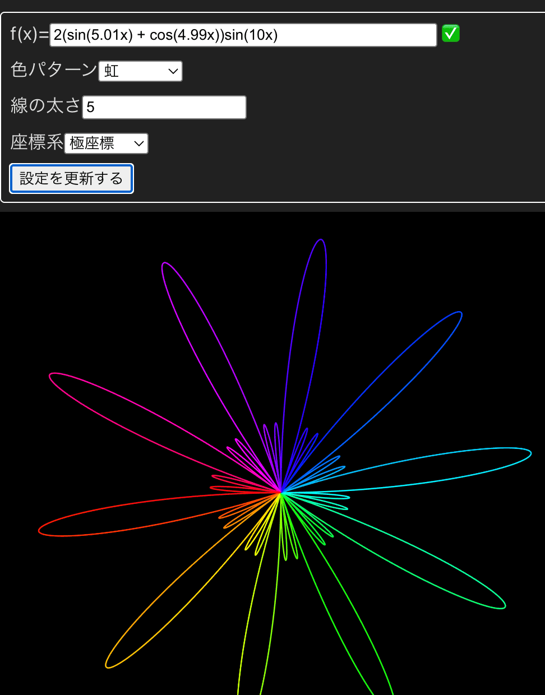
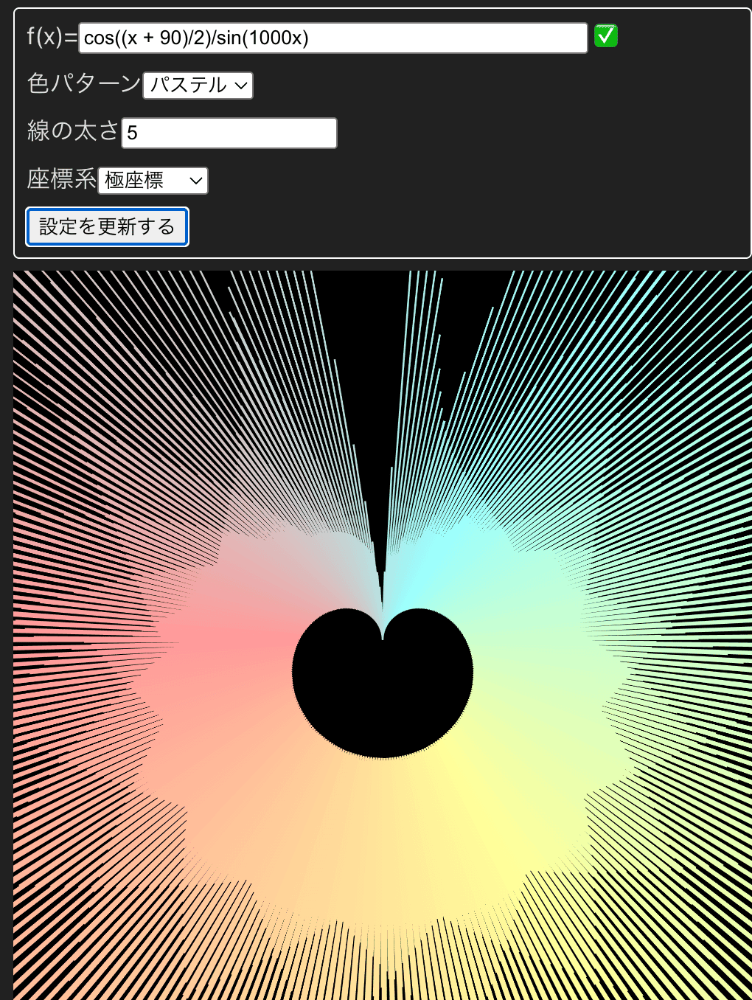

# dgraph
A tool for visualizing arbitrary real number function (f(x)).

## Features

- **Mathematical Function Visualization**: Render arbitrary real number functions f(x) on HTML5 canvas
- **Multiple Coordinate Systems**: Support for both orthogonal and polar coordinate systems
- **Color Patterns**: Various drawing patterns including rainbow, pastel, and more
- **Real-time Rendering**: Interactive visualization with customizable settings
- **URL Sharing**: Share your visualizations with others via URL - settings are encoded in the URL for easy sharing
- **Mobile & Tablet Support**: Fully responsive design optimized for smartphones and tablets
- **PWA Support**: Installable as a standalone mobile/desktop application

## Samples

### Polar Coordinate Visualization with Rainbow Pattern
`f(x) = 2(sin(5.01x) + cos(4.99x))sin(10x)`



### Polar Coordinate with Pastel Colors
`f(x) = cos((x + 90)/2)sin(1000x)`



## Building the development environment
```bash
npm install
```

## Build for development
We use vite (for TypeScript). Run the below script.
```bash
npm run dev
```

## Build for production
```bash
npm run build
```

